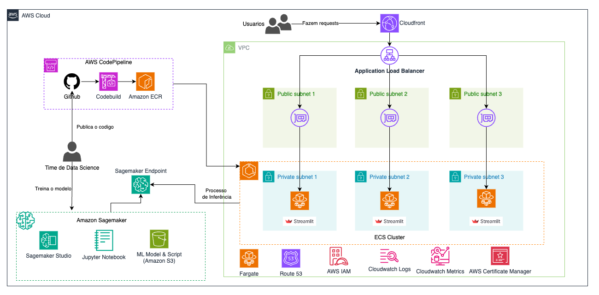

# Projeto de Predição de Ataques Cardíacos

## Visão Geral

Este projeto utiliza aprendizado de máquina para prever a probabilidade de ataques cardíacos com base em diversos fatores de saúde. O modelo foi treinado usando um notebook Jupyter e implementado em uma aplicação Streamlit, que está hospedada na AWS.

Atualmente a aplicação esta disponivel na url https://indicadorescardiacos.tech/

## Treinamento do Modelo

O modelo foi treinado usando um notebook Jupyter que realiza as seguintes etapas:

1. Carregamento e pré-processamento dos dados
2. Divisão dos dados em conjuntos de treino e teste
3. Treinamento de um modelo Random Forest
4. Avaliação do modelo usando métricas como acurácia e recall
5. Análise das features mais importantes
6. Salvamento do modelo treinado em formato bin
7. Deploy do modelo para inferencia no Sagemaker

## Aplicação Streamlit

Uma aplicação web interativa foi desenvolvida usando Streamlit para permitir que os usuários insiram seus dados de saúde e obtenham uma previsão de risco de ataque cardíaco.

## Arquitetura AWS

O projeto está hospedado na AWS com a seguinte arquitetura:

- VPC com subnets públicas e privadas
- Application Load Balancer para distribuir o tráfego
- Cluster ECS para executar a aplicação em contêineres
- AWS CodePipeline para CI/CD, integrando com GitHub
- Amazon SageMaker para hospedar o modelo de machine learning
- Serviços auxiliares: CloudWatch, IAM, Parameter Store

## Dockerfile

Este [Dockerfile](Dockerfile) configura um ambiente Python, instala as dependências necessárias, e prepara a aplicação Streamlit para ser executada em um contêiner.

## Como Executar Localmente

1. Clone o repositório
2. Instale as dependências: `pip install -r requirements.txt`
3. Execute a aplicação Streamlit: streamlit run streamlit.py
